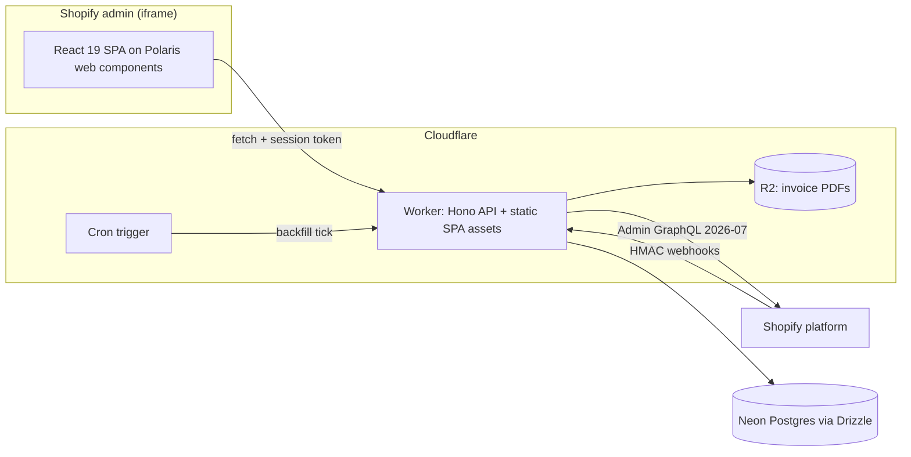
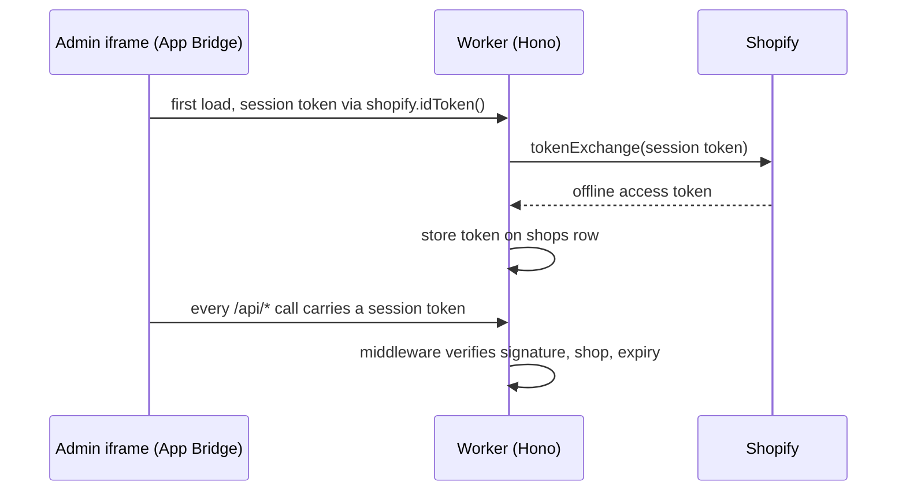
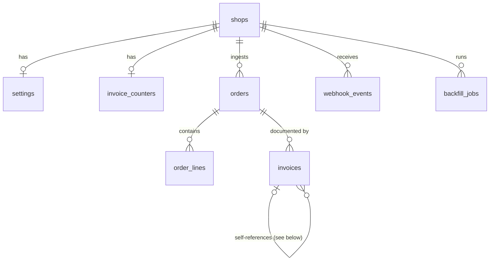

# Architecture

This document is the system map for Tekikaku: the runtime diagram, the core flows (auth, webhook ingestion, invoice issue, backfill), and the entity-relationship diagram. The single most important point: one Cloudflare Worker serves both the SPA and the API, and every fact about scope, columns, and platform behavior lives in [SPEC.md](SPEC.md), which this document links into rather than restates. Contents: system overview, auth flow, webhook ingestion flow, invoice issue flow, backfill flow, and data model.

## Table of contents

- [System overview](#system-overview)
- [Auth flow](#auth-flow)
- [Webhook ingestion flow](#webhook-ingestion-flow)
- [Invoice issue flow](#invoice-issue-flow)
- [Backfill flow](#backfill-flow)
- [Data model](#data-model)

## System overview

Decided in [Goals and positioning](SPEC.md#goals-and-positioning) (free-tier constraint) and [Platform verification results](SPEC.md#platform-verification-results-2026-07-24) (Workers limits, static asset serving).

## Auth flow

Managed installation and token exchange; there is no OAuth redirect code. Decided in [Shopify API surface](SPEC.md#shopify-api-surface).

## Webhook ingestion flow

HMAC verification and idempotency via the `webhook_events` table. Decided in [Feature list](SPEC.md#feature-list) item 3 and [Query performance](SPEC.md#query-performance-the-performant-sql-evidence).

1. Verify the HMAC header against the raw body before parsing.
2. `INSERT ... ON CONFLICT DO NOTHING` on `shopify_webhook_id`; a conflict means a duplicate delivery, ack and stop.
3. Normalize the payload into `orders` + `order_lines` (per-line tax rate, reduced-rate flag).
4. `orders/create` proactively issues an invoice; `refunds/create` issues a credit note; `app/uninstalled` marks the shop uninstalled and invalidates the token.
5. Missing tax lines block generation with a per-order warning instead of emitting a wrong invoice ([risk 5](SPEC.md#top-5-risks-and-mitigations)).

## Invoice issue flow

The tax engine and immutability rules are specified in [Feature list](SPEC.md#feature-list) items 5 and 6; the transactional boundary is decided in [Invoice numbering transactional boundary](SPEC.md#invoice-numbering-transactional-boundary-decided-2026-07-25).

1. Aggregate line items per tax rate, apply the merchant's rounding mode exactly once per rate.
2. Open the issue transaction and claim the next number: `UPDATE invoice_counters ... RETURNING`.
3. Render the PDF (pre-subsetted Japanese font, embedded with `subset: false`, see [risk 1](SPEC.md#top-5-risks-and-mitigations)) and upload it to R2 under a key derived from the claimed number.
4. Insert the immutable `invoices` row complete with per-rate totals and `r2_key`, then commit. A crash before commit rolls back the number claim: no gap, at worst an orphaned R2 object.
5. Corrections never mutate: void the original, issue a replacement, keep the `supersedes` chain.

## Backfill flow

Cron-tick batch processing over Admin GraphQL, a simplicity choice per [Feature list](SPEC.md#feature-list) item 8.

1. The merchant creates a `backfill_jobs` row with a date range.
2. Each cron tick resumes from `graphql_cursor`, pages orders with cost-aware backoff, and processes a bounded batch to stay inside the CPU budget.
3. Already-ingested orders are skipped by the same `ON CONFLICT` dedupe probe as webhooks.
4. Progress (`orders_seen`, `invoices_created`) is polled by the UI.

## Data model

Full column lists, portability rules, and index rationale: [Data model sketch](SPEC.md#data-model-sketch).

The single self-loop stands in for two nullable self-FKs, drawn as one edge because Mermaid stacks multiple self-relations on top of each other: `supersedes_invoice_id` (a reissue supersedes exactly one voided invoice, at most one successor) and `original_invoice_id` (a credit note references exactly one invoice; partial refunds mean one invoice can accumulate many credit notes). `invoices.shop_id` is also omitted from the diagram for legibility; it exists to back the `(shop_id, number)` unique index.
